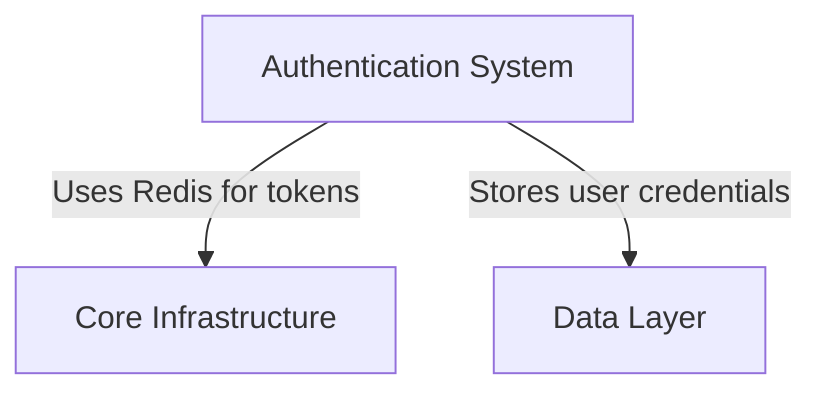

# Architecture Documentation Generator

**Cliff Notes for Code** — Automatically generate comprehensive `ARCHITECTURE.md` documentation for any codebase using LLM-guided exploration and synthesis.

---

## The Problem

Have you ever cloned an unfamiliar open-source project and faced hundreds of files—abstractions built on abstractions, frameworks you're only partially familiar with, architectural decisions that aren't documented anywhere? Complex codebases are like dense literary works: they need an interpretive layer to make them understandable.

Some books can't be read without Cliff Notes. The same is true for code.

## The Solution

This project uses LLMs combined with structured multi-session workflows to create comprehensive architectural documentation for any codebase. Instead of overwhelming the LLM with thousands of files at once, it explores the project incrementally across multiple sessions, building a structured knowledge base that's then synthesized into clear, narrative documentation.

Think of it as **progressive rendering for documentation**—starting pixelated and gradually becoming crystal clear.

---

## How It Works

### Two-Phase Architecture

#### **Phase 1: Survey & Exploration** (Sessions 1-N)

The LLM acts as a **System Archaeologist**, exploring the codebase to discover and document architectural systems:

- Identifies major systems (Authentication, Data Layer, API, etc.)
- Maps key files to each system
- Records insights about design patterns and decisions
- Notes complexities and technical debt
- Tracks system dependencies and integration points

**Output:** `architecture.json` — a structured knowledge base of architectural systems

**Quality Guarantees:**

- **Objective Metrics:** All completeness scores are computed from file counts, insight depth, and dependency mapping—no manual overrides
- **Validated Insights:** Every insight must meet quality standards (15+ words, structured format, substantive content)
- **Anti-Gaming Measures:** Systems cannot claim high completion without genuine exploration depth
- **Reproducible Results:** Same exploration data produces identical metrics across sessions

#### **Phase 2: Synthesis & Writing** (Sessions N+1 onwards)

The LLM becomes a **Narrative Architect**, writing `ARCHITECTURE.md` section by section:

- Transforms structured notes into narrative prose
- Explains the "why" behind design decisions
- Uses a "Cliff Notes" style: clear, educational, narrative-driven
- Focuses on understanding over completeness

**Output:** `ARCHITECTURE.md` — comprehensive architectural documentation

### Why This Approach?

- ✅ **Eliminates context overflow:** LLM explores incrementally, not all at once
- ✅ **Prevents contradictions:** Phase 1 completes before Phase 2 begins
- ✅ **Separates concerns:** Discovery vs. synthesis are different mental modes
- ✅ **Session-friendly:** Natural checkpoint at phase transition
- ✅ **Quality-focused:** Structured exploration produces better synthesis material
- ✅ **Trustworthy metrics:** Objective, reproducible measurements prevent gaming

---

## Getting Started

### Prerequisites

- Python 3.8+
- Access to an LLM with file access capabilities (Claude, GPT-4, etc.)
- Terminal/command-line access

### Installation

1. **Clone this repository:**

```bash
git clone https://github.com/yourusername/arch-doc-generator.git
cd arch-doc-generator
```

2. **Make `arch_state` globally accessible:**

**Linux/macOS (Bash/Zsh):**

```bash
# Add to ~/.bashrc or ~/.zshrc
export PATH="/path/to/arch-doc-generator:$PATH"

# Make executable
chmod +x arch_state.py
```

**Windows (PowerShell):**

```powershell
# Add to PowerShell profile
$env:Path += ";C:\path\to\arch-doc-generator"
```

3. **Verify installation:**

```bash
arch_state --help
```

### Usage

#### Step 1: Initialize Your Project

Navigate to the codebase you want to document:

```bash
cd /path/to/your-project
arch_state init "Your Project Name"
```

This creates `architecture.json` with project metadata and performs an intelligent scan to identify significant files (excluding data files, assets, and generated content).

#### Step 2: Phase 1 — Exploration

Start an exploration session with your LLM, using the **System Archaeologist** persona (see `system_archaeologist.md`).

**Session workflow:**

```bash
# Start session tracking
arch_state session-start

# LLM explores the codebase and guides you to run commands like:
arch_state add "Authentication System"
arch_state map "Authentication System" src/auth/login.py src/auth/middleware.py
arch_state insight "Authentication System" "Implements JWT-based auth using RS256 signing, which enables stateless verification across distributed services"
arch_state dep "Authentication System" "Core Infrastructure" "Uses Redis cache for tokens"

# Check progress
arch_state status
arch_state coverage

# End session
arch_state session-end
```

**Quality Standards Enforced:**

- **Insight Quality:** Minimum 15 words, must follow "[WHAT] using [HOW], which [WHY/IMPACT]" structure
- **Completeness Thresholds:**
  - 50%+ completeness requires 3+ insights minimum
  - 80%+ completeness requires 5+ insights minimum
- **Computed Metrics:** Completeness automatically calculated from:
  - File coverage (40 points)
  - Insight depth (35 points)
  - Dependency mapping (15 points)
  - Clarity level (0-10 bonus points)

**Continue sessions until Phase 1 stopping criteria met:**

- **Gate A:** Coverage ≥ 90% of significant files
- **Gate B:** 3 consecutive low-yield sessions (tracked automatically)

#### Step 3: Validation

Before moving to Phase 2:

```bash
arch_state validate
```

This checks for:

- Systems missing minimum required insights
- Invalid dependency references
- Data quality issues

Fix any errors reported before proceeding to Phase 2.

#### Step 4: Phase 2 — Synthesis

Switch to the **Narrative Architect** persona (see `narrative_architect.md`).

**Session workflow:**

```bash
# Get overview
arch_state list
arch_state status

# View system details for writing
arch_state show "Authentication System"
arch_state show "Authentication System" --summary

# Generate dependency diagram
arch_state graph

# Write ARCHITECTURE.md section by section using the system data
```

The LLM writes narrative prose based on the structured knowledge from Phase 1.

---

## CLI Reference

### Session Management

```bash
arch_state session-start        # Begin session tracking
arch_state session-end          # Record session metrics
```

### System Management

```bash
arch_state add "System Name"                    # Create new system
arch_state map "System Name" file1.py file2.py  # Map files to system
arch_state update "System Name" --desc "..."    # Update description (completeness auto-computed)
arch_state insight "System Name" "Insight text..."      # Add architectural insight (validated)
arch_state dep "System Name" "Target" "Reason"          # Add dependency
```

**Note:** The `--comp` and `--clarity` flags have been removed. These values are now automatically computed from objective metrics.

### Inspection

```bash
arch_state status              # Overall project state & progress
arch_state list                # List all systems with completeness
arch_state show "System Name"  # View system details (full)
arch_state show "System Name" --summary  # Condensed view
arch_state coverage            # Directory-level coverage analysis
arch_state graph               # Generate Mermaid dependency diagram
arch_state validate            # Check for data quality issues
```

---

## Understanding Metrics

### Coverage Quality (≤100%)

Measures how well significant files have been mapped to systems:

```
Coverage Quality = (Mapped Significant Files / Total Significant Files) × 100
```

**What counts as "significant"?**

- Files >1KB in size
- Source code files (`.py`, `.ts`, `.rs`, etc.) are always significant
- Config/documentation files (`.json`, `.md`, `.yaml`) if <50KB
- Excludes: data files, assets, dependencies, test fixtures, generated code

**Example:** A project with 100 significant files where 85 are mapped = 85% coverage quality

### System Completeness (0-100%)

Auto-computed from four objective metrics:

```
Completeness = File Coverage (40 pts)
             + Insight Depth (35 pts)
             + Dependencies (15 pts)
             + Clarity Bonus (0-10 pts)
```

**Component Details:**

1. **File Coverage (max 40 points):**
   - `min(file_count / 10, 1.0) × 40`
   - 10+ files = full points
2. **Insight Depth (max 35 points):**
   - `min(insight_count / 5, 1.0) × 35`
   - 5+ insights = full points
3. **Dependency Mapping (15 points):**
   - Binary: 15 if system has documented dependencies, 0 otherwise
4. **Clarity Bonus (0-10 points):**
   - High clarity: +10 points
   - Medium clarity: +5 points
   - Low clarity: 0 points

**Example Calculation:**

```
System with 7 files, 3 insights, 1 dependency, medium clarity:
= (7/10 × 40) + (3/5 × 35) + 15 + 5
= 28 + 21 + 15 + 5
= 69%
```

### Clarity Levels

Auto-computed from objective rubric:

| Level      | Requirements                                                |
| ---------- | ----------------------------------------------------------- |
| **High**   | 5+ insights AND 70%+ base completeness AND has dependencies |
| **Medium** | 3-4 insights AND 40-69% base completeness                   |
| **Low**    | 0-2 insights OR <40% base completeness                      |

**Note:** "Base completeness" excludes the clarity bonus to avoid circular dependency.

### Why These Metrics Matter

**Before (Manual System):**

- AI could claim 100% completeness with 1 insight
- Coverage quality could exceed 100% (mathematical impossibility)
- Metrics were subjective and inconsistent

**After (Computed System):**

- High completeness requires genuine exploration depth
- All metrics are mathematically valid and reproducible
- Same exploration data produces identical scores every time
- Gaming the system is effectively impossible

---

## State File Structure

The `architecture.json` file uses a system-centric schema:

```json
{
  "schema_version": "2.2",
  "metadata": {
    "project_name": "Your Project",
    "project_type": "Django Web Application",
    "last_updated": "2025-11-20T10:30:00",
    "phase": "survey",
    "total_sessions": 5,
    "scan_stats": {
      "coverage_percentage": 87.5,
      "coverage_quality": 92.3,
      "significant_files": 100,
      "mapped_files": 85
    }
  },
  "systems": {
    "Authentication System": {
      "description": "Handles user authentication using JWT tokens",
      "completeness": 69,
      "clarity": "medium",
      "key_files": [
        "src/auth/login.py",
        "src/auth/middleware.py",
        "src/auth/tokens.py",
        "src/auth/decorators.py",
        "src/auth/validators.py",
        "src/auth/refresh.py",
        "src/auth/logout.py"
      ],
      "insights": [
        "Implements JWT-based authentication using RS256 signing, which enables stateless verification across distributed services without database lookups",
        "Token refresh mechanism integrates with Redis cache using sliding window TTL, which reduces database load during high-traffic periods by approximately 60%",
        "Decorator pattern provides declarative route protection through @require_auth and @require_role annotations, which simplifies permission logic and keeps controllers clean"
      ],
      "complexities": [
        "Middleware execution order isn't enforced programmatically - relies on MIDDLEWARE list position in settings.py"
      ],
      "dependencies": [
        {
          "system": "Core Infrastructure",
          "reason": "Uses Redis for token caching and session management"
        }
      ]
    }
  }
}
```

**Computed Fields:**

- `completeness`: Auto-calculated from files, insights, dependencies, and clarity
- `clarity`: Auto-computed from insight count and base completeness thresholds

---

## LLM Personas

This project includes two specialized LLM personas:

### Phase 1: System Archaeologist

**Role:** Explore the codebase and build structured knowledge

**Key behaviors:**

- Breadth-first discovery (identify all systems before deep-diving)
- Evidence-based analysis (never guesses file contents)
- Structured note-taking (insights follow "[WHAT] using [HOW], which [WHY]" template)
- Session discipline (always runs `session-start` and `session-end`)
- Quality awareness (understands that completeness is computed, not claimed)

📄 Full persona: `system_archaeologist.md`

### Phase 2: Narrative Architect

**Role:** Synthesize structured knowledge into narrative documentation

**Key behaviors:**

- "Cliff Notes" writing style (explain WHY, not just WHAT)
- Narrative flow (systems as characters in a story)
- Plain language (define jargon, avoid walls of code)
- Progressive disclosure (high-level → detailed)

📄 Full persona: `narrative_architect.md`

---

## Design Philosophy

### System-Centric Thinking

Documentation is organized around **systems** (cohesive groups of 2-10 files providing a major capability), not files or directories.

**Good system names:**

- ✅ Authentication System
- ✅ Data Persistence Layer
- ✅ Background Task Queue

**Bad system names:**

- ❌ Backend / Frontend (too broad)
- ❌ JWT Token Generation (too narrow—this is a component)
- ❌ Controllers / Models (architectural layers, not capabilities)

### Insight Quality Standards

Every insight must follow the template: **[WHAT] using [HOW], which [WHY/IMPACT]**

This structure is enforced at entry time with validation:

**Good examples:**

> "Implements token refresh using Redis cache with sliding window TTL, which reduces database load during high-traffic periods by 60%"

> "Handles file uploads through presigned S3 URLs generated by the API, which eliminates bottlenecks from routing large payloads through application servers"

**Bad examples:**

> "Uses JWT" ❌ (Too short, no structure)

> "Handles authentication stuff" ❌ (No specifics, no impact)

> "Token system works well" ❌ (No technical details)

**Validation Rules:**

- Minimum 15 words
- Must contain action verb (implements, provides, handles, manages, etc.)
- Must contain impact statement (which, enabling, reducing, improving, etc.)
- Warnings issued with override option (soft enforcement)

### Intelligent File Classification

The system uses a 4-phase heuristic engine to identify truly significant files:

**Phase 1: Size Filter**

- Files <1KB are considered noise and excluded

**Phase 2: Directory Context**

- Auto-excludes: `data/`, `assets/`, `fixtures/`, `node_modules/`, `.git/`, etc.
- Configurable via `CLASSIFICATION_CONFIG` in `constants.py`

**Phase 3: Extension Semantics**

- **Code files** (`.py`, `.ts`, `.rs`, `.go`): Always significant
- **Data files** (`.csv`, `.sql`, `.lock`, `.pickle`): Never significant
- **Config/Docs** (`.json`, `.md`, `.yaml`, `.rst`): Significant only if <50KB

**Phase 4: Statistical Outliers**

- Uses Interquartile Range (IQR) detection
- Rejects massive files (e.g., 5MB JSON wordlist) that skew metrics
- Code files exempt from outlier detection

**Impact:**

- Before: 1,172 "significant" files (mostly noise), 13% coverage
- After: ~300 actual architectural files, effectively tripling meaningful coverage

### Stopping Criteria: Two-Gate Algorithm

Phase 1 ends when **either** condition is met:

- **Gate A:** Coverage ≥ 90% of significant files
- **Gate B:** 3 consecutive low-yield sessions (<1 new system, <3 new files each)

This prevents both premature completion and diminishing returns.

---

## Project Origin

This project started from a personal frustration: understanding complex open-source codebases I didn't write. Some works of literature can't be read without Cliff Notes—not because readers are lazy, but because the layers of abstraction are too dense to parse on first reading. Code is the same way.

The breakthrough was recognizing that this couldn't be a single-session task. By splitting exploration (Phase 1) from synthesis (Phase 2), and using structured state management (`architecture.json`) as the handoff mechanism, we can build comprehensive documentation incrementally without overwhelming LLM context windows.

**Evolution:**

- **Initial Version:** Simple file scanning and manual metrics
- **Phase 1 Quality Fixes:** Added objective metric computation, insight validation, anti-gaming measures (November 2025)
- **Intelligent Classification:** Replaced size-only threshold with context-aware heuristics (November 2025)

This is an **educational tool**—designed to make complex codebases learnable in a fraction of the time it would take to read them file by file.

---

## Advanced Usage

### Coverage Analysis

The `coverage` command shows directory-level mapping statistics:

```bash
arch_state coverage
```

**Output:**

```
=== 📊 COVERAGE BY DIRECTORY ===
✅ src/auth                [██████████] 100% (8/8)
⚠️  src/api                [██████░░░░]  60% (12/20)
❌ src/background          [██░░░░░░░░]  20% (2/10)

=== 📄 TOP UNMAPPED FILES ===
  1. src/background/celery_config.py     (15.2 KB)
  2. src/api/serializers.py              (12.8 KB)
```

Use this to identify exploration gaps.

### Dependency Visualization

Generate a Mermaid diagram of system dependencies:

```bash
arch_state graph
```

**Output:**



Paste this into `ARCHITECTURE.md` for visual system relationships.

### Session History

View exploration trajectory:

```bash
arch_state status
```

Shows:

- Total sessions run
- Systems identified per session
- Files mapped per session
- Insights added per session
- Gate A/B status
- Computed completeness breakdown

---

## Quality Assurance

### Test Coverage

```bash
==================== 121 passed in 0.44s ====================
Coverage: 92%
```

**Test Categories:**

- End-to-end workflow tests
- Metric computation validation
- Insight quality validation
- File classification accuracy
- State persistence and loading
- CLI command integration

### Anti-Gaming Verification

**Can an AI claim 90% completeness without deep exploration?**

**Before Phase 1 fixes:** ✅ Yes (run `arch_state update System --comp 90`)

**After Phase 1 fixes:** ❌ No

- Need 9+ files mapped (36 points)
- Need 5 insights with 15+ words each (35 points)
- Need documented dependencies (15 points)
- Need high clarity (10 points)
- **Total effort required:** Map files + write substantive insights + document dependencies

**Verdict:** Gaming vectors eliminated. High completeness requires genuine understanding.

---

## Configuration

### File Classification

Edit `src/arch_scribe/core/constants.py` to customize classification:

```python
CLASSIFICATION_CONFIG = {
    "min_size_bytes": 100,          # Minimum file size
    "size_threshold_kb": 1,         # Size filter (Phase 1)
    "max_config_size_kb": 50,       # Config/docs threshold (Phase 3)
    "data_directories": [           # Excluded directories (Phase 2)
        "data", "assets", "fixtures", "node_modules",
        ".git", "dist", "build", "__pycache__"
    ]
}
```

### Completeness Formula Weights

To adjust completeness calculation weights:

```python
# In src/arch_scribe/core/state_manager.py
COMPLETENESS_WEIGHTS = {
    "files": 40,        # File coverage weight
    "insights": 35,     # Insight depth weight
    "dependencies": 15, # Dependency mapping weight
    "clarity": 10       # Clarity bonus weight
}
```

---

## Contributing

Contributions welcome! This is an experimental project focused on LLM-guided documentation workflows.

**Areas of interest:**

- Improved heuristics for system discovery
- Project type detection and templates
- Additional insight quality patterns
- Phase transition optimization
- Custom metric weighting per project type

**To contribute:**

1. Fork the repository
2. Create a feature branch
3. Make your changes with clear commit messages
4. Run test suite: `pytest tests/ -v --cov`
5. Submit a pull request

---

## License

MIT License

Copyright (c) 2025

Permission is hereby granted, free of charge, to any person obtaining a copy
of this software and associated documentation files (the "Software"), to deal
in the Software without restriction, including without limitation the rights
to use, copy, modify, merge, publish, distribute, sublicense, and/or sell
copies of the Software, and to permit persons to whom the Software is
furnished to do so, subject to the following conditions:

The above copyright notice and this permission notice shall be included in all
copies or substantial portions of the Software.

THE SOFTWARE IS PROVIDED "AS IS", WITHOUT WARRANTY OF ANY KIND, EXPRESS OR
IMPLIED, INCLUDING BUT NOT LIMITED TO THE WARRANTIES OF MERCHANTABILITY,
FITNESS FOR A PARTICULAR PURPOSE AND NONINFRINGEMENT. IN NO EVENT SHALL THE
AUTHORS OR COPYRIGHT HOLDERS BE LIABLE FOR ANY CLAIM, DAMAGES OR OTHER
LIABILITY, WHETHER IN AN ACTION OF CONTRACT, TORT OR OTHERWISE, ARISING FROM,
OUT OF OR IN CONNECTION WITH THE SOFTWARE OR THE USE OR OTHER DEALINGS IN THE
SOFTWARE.

---

## Acknowledgments

- Inspired by the challenge of understanding complex open-source projects
- Built on experience with 30+ session multi-turn LLM workflows
- Architecture adapted from proven `student.py` state management pattern
- Special thanks to the concept of "Cliff Notes for code"—documentation should educate, not just enumerate
- Quality fixes informed by real-world testing on monkeytype and git-truck projects

---

## Changelog

### Version 2.2 (November 2025)

**Phase 1 Quality Improvements:**

- ✅ Fixed coverage quality calculation (was exceeding 100%)
- ✅ Added insight quality validation (15+ word minimum, structural requirements)
- ✅ Implemented computed completeness (eliminated manual `--comp` flag)
- ✅ Added auto-computed clarity levels (eliminated manual `--clarity` flag)
- ✅ Enforced minimum insight requirements tied to completeness thresholds

**Intelligent File Classification:**

- ✅ Replaced simplistic size threshold with 4-phase heuristic engine
- ✅ Added directory context awareness (auto-excludes data/, assets/, etc.)
- ✅ Implemented extension semantics (code vs. config vs. data)
- ✅ Added statistical outlier detection using IQR
- ✅ Configurable classification rules via constants

**Impact:**

- Metrics are now reproducible and objective
- Gaming the system is effectively impossible
- Coverage quality accurately reflects architectural file mapping
- Test coverage: 121 tests passing (100%), 92% code coverage

---

## Roadmap

- [ ] Template-based Phase 2 section generation
- [ ] Git integration for tracking documentation drift
- [ ] Web UI for `architecture.json` visualization
- [ ] Export formats (HTML, PDF)
- [ ] Integration with documentation hosting platforms
- [ ] Machine learning model for project type detection
- [ ] Configurable metric weights per project type
- [ ] Historical completeness tracking and progression charts

---

**Questions? Issues? Feedback?**

Open an issue on GitHub or start a discussion. This is an experimental educational project—collaboration and ideas are welcome!
